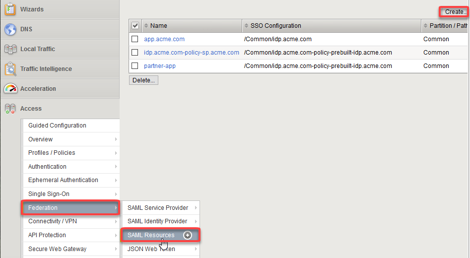
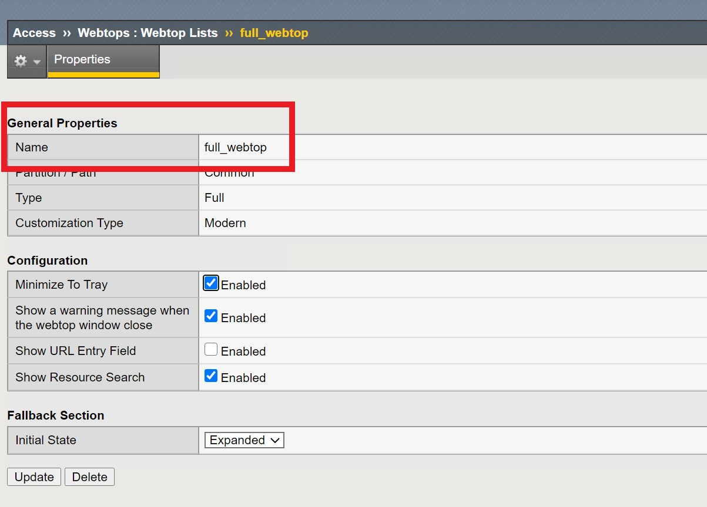
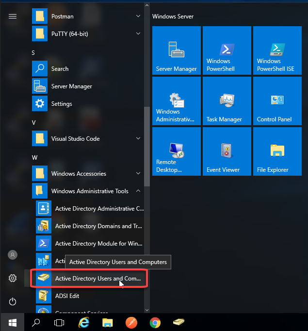
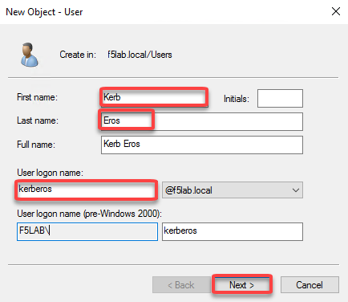
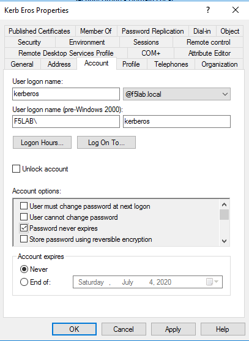
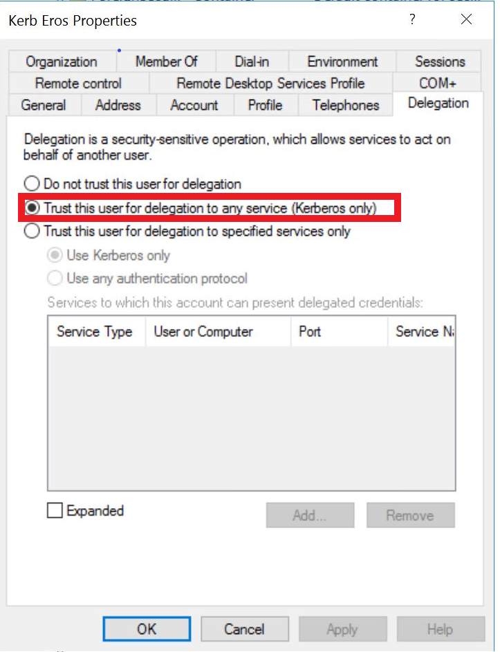
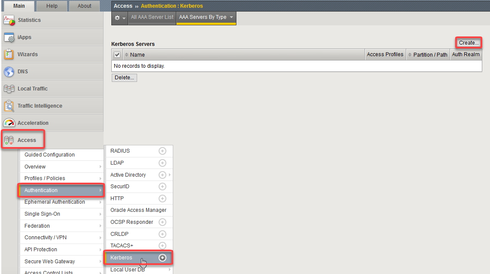

Lab 3: SSO Lab
===========================

The purpose of this lab is to demonstrate Single Sign-On capabilities
of APM.    The SSO Credential Mapping action enables users to forward
stored user names and passwords to applications and servers automatically,
without having to input credentials repeatedly.   This allows single
sign-on (SSO) functionality for secure user access.  As different applications
and resources support different authentication mechanisms, the SSO system
may be required to store and translate credentials that differ from the
user name and password a user inputs on the logon page.  The SSO credential
mapping action allows for credentials to be retrieved from the logon
page, or in another way for both the user name and the password.

This lab will demonstrate one SSO method, although a number of different SSO
methods exist.  This lab will demonstrate the Kerberos to SAML method.

Objective:

-  Gain an understanding of SSO Token User Name Caching and SSO Token Password
   Caching.

-  Gain an understanding of the Kerberos to SAML relationship and its
   component parts.

-  Develop an awareness of the different deployment models that Kerberos
   to SAML authentication opens up

Lab Requirements:

-  All Lab requirements will be noted in the tasks that follow

Estimated completion time: 15 minutes

TASK 1: Create an SSO object and Webtop Resource
~~~~~~~~~~~~~~~~~~~~~~~~~~~~~~~~~~~~~~~~~~~~~~~~

______________________________________________________________

SAML Resource

#.  Begin by selecting Access > Federation > SAML Resources

#.  Click the Create button (far right)

#.  In the New SAML Resource window, enter the following values:

    +--------------------+---------------------------------+
    | Name:              | ``parnter-app``                 |
    +--------------------+---------------------------------+
    | SSO Configuration: | ``idp.acme.com``                |
    +--------------------+---------------------------------+
    | Caption:           | ``parnter-app``                 |
    +--------------------+---------------------------------+

Click Finished at the bottom of the configuration window

Webtop

#.	Select Access > Webtops > Webtop List

#.	Click Create button (far right)

#.	In the resulting window, enter the following values

	Name	full_webtop
	Type	Full (drop down)

Click finished at the bottom of the GUI

TASK 2 – Configure an Active Directory account, Kerberos AAA Object, and keytab file
~~~~~~~~~~~~~~~~~~~~~~~~~~~~~~~~~~~~~~~~~~~~~~~~~~~~~~~~~~~~~~~
______________________________________________________________

#. From the Jumphost click **Windows Menu -> Administrative Tools -> Active Directory Users and Computers**

#. From the File menu click on **Action -> New -> User**

#. Create a new Active Directory User Account with the follow attributes:

#. The Active Directory account should be name "kerbsso".

*Note: The Active Directory Domain is f5lab.local and thus the AD User Account will reflect a user*
       *account with a User Logon Name of kerberos@f5lab.local versus kerberos@acme.com*

**Click on the delegation tab of the new Active Directory User Account and ensure the following is checked**

#. The next step is the run the ktpass command from the Windows command line as follows below

     ``ktpass /princ HTTP/kerberos.f5lab@ACME.COM /mapuser f5lab\kerberos /ptype KRB5_NT_PRINCIPAL /pass password /out c:\file.keytab``

#. Create the Kerberos AAA object by navigating to **Access -> Authentication -> Kerberos**

+--------------------+---------------------------------+
| Name:              | ``Kerbos_SSL``                  |
+--------------------+---------------------------------+
| Auth Realm:        | ``F5LAB.LOCAL``                 |
+--------------------+---------------------------------+
| Service Name:      | ``HTTP``                        |
+--------------------+---------------------------------+

#. Click the **Choose File** button and browse to locate the Keytab file (The Keytab file should be located at c:\file.keytab)

#. Click Finished to complete the creation of the AAA object

#.  Review the AAA server configuration at Access, Authentication

TASK 3: Configure, Modify, and test a new Access Profile
~~~~~~~~~~~~~~~~~~~~~~~~~~~~~~~~~~~~~~~~~~~~~~~~
______________________________________________________________

#. Navigate to Access, Profiles, Per-Session Profiles and create a new Per-Session Access Profile called (Kerb_SAML)

#. Edit the new Access Profile with the following settings:

#. Click on the + sign between Start and Deny

#. The Logon Tab will display a number of options.  Click the radio button next to
	HTTP 401 Response and click Add Item.

#. Now click on the HTTP 401 Response object and enter the configuration parameters as indicated below

#. In the **HTTP 401 Response** dialog box, enter the following information:

   +-------------------+---------------------------------+
   | Basic Auth Realm: | ``f5lab.local``                 |
   +-------------------+---------------------------------+
   | HTTP Auth Level:  | ``basic+negotiate`` (drop down) |
   +-------------------+---------------------------------+

#. Click the **Save** button at the bottom of the dialog box

#. Click on the + sign to the top right of the HTTP 401 Response that specifies **Basic**

#. Click on the Authentication tab, select the AD Auth object by clickin the radio button and click Add Item

#. Click on the AD Auth object and select the /Common/AD_Server object under the Server drop down menu

#. Click on Save

#. Change the Successful Branch to Allow

#. Click on the + to the right of the **Negotiate** branch of the HTTP 401 Response object

#. Click on the **SAML Auth** radio button and click on Add item

#. Click on the SAML Auth object and select the /Common/app.acme.com object next to the AAA Server section

#. Click on the Branch Rules tab

#. Name the Branch **Successful**, and ensure the Expression is set to **SAML Auth has Passed**

#. Click Save

#. On the Successful branch of the SAML Auth object modify the setting to Allow

#. Click on Apply Policy

#. The final step in this lab is the Access Policy to the app.acme.com Virtual Server

#. Within the GUI navigate to Local Traffic, Virtual Servers, and click on the app.acme.com Virtual Server

#. Scroll down to the Access Policy section and select your new Access Policy and click the update button at the bottom of the page.

TASK 4 - Test the Kerberos to SAML Configuration
~~~~~~~~~~~~~~~~~~~~~~~~~~~~~~~~~~~~~~~~~~~~~~~~
______________________________________________________________

.. NOTE:: In the following Lab Task it is recommended that you use Microsoft
   Internet Explorer.  While other browsers also support Kerberos
   (if configured), for the purposes of this Lab Microsoft Internet
   Explorer has been configured and will be used.

#. Using Internet Explorer on the jump host type in https://app.acme.com

#. Were you prompted for credentials? Were you successfully authenticated?
   
#. Review your Active Sessions **(Access ‑> Overview ‑> Active Sessions­­­)**

#. Review your Access Report Logs **(Access ‑> Overview ‑> Access Reports)**
