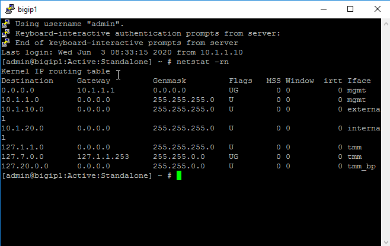
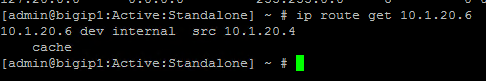
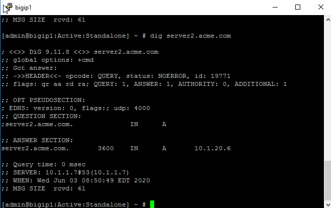
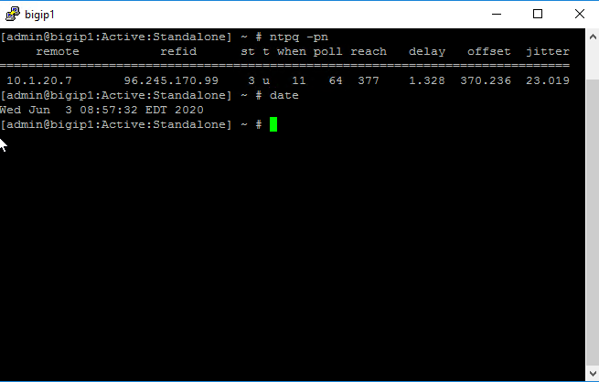
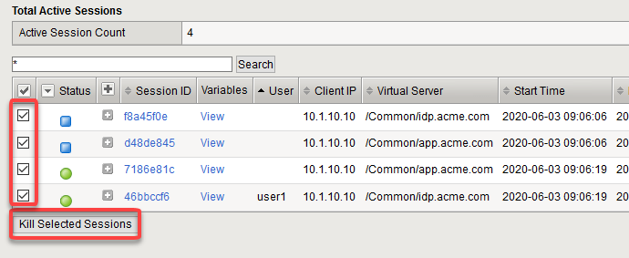
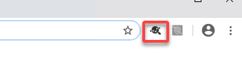
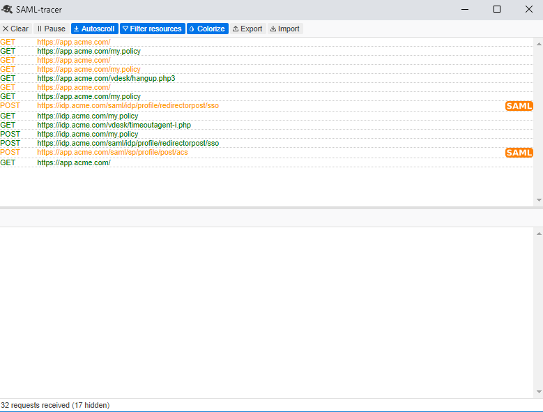
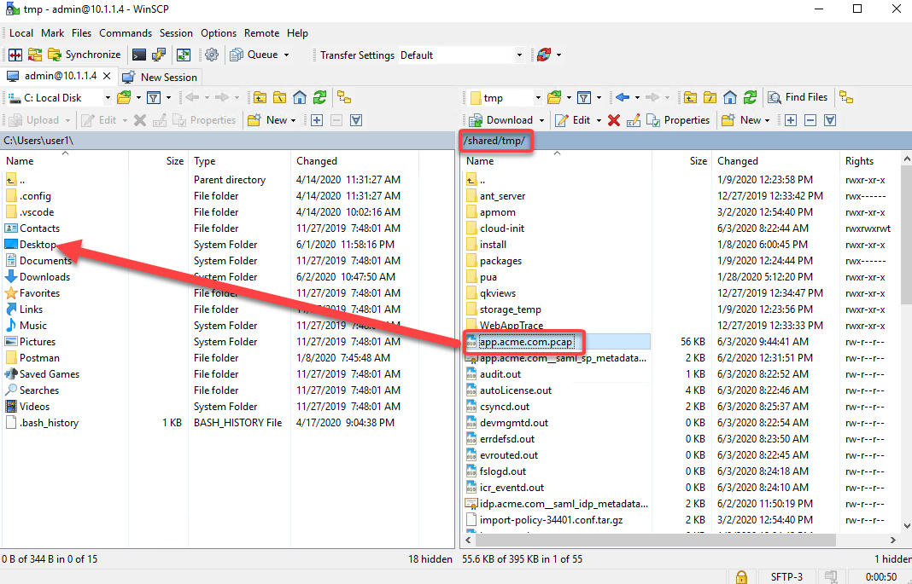

Lab 4: Troubleshooting
==========================================

.. toctree::
   :maxdepth: 1
   :glob:

Welcome to the troubleshooting APM Policies lab.  This lab is optional.
The lab exercises will provide guidance on how to configure and troubleshoot
common Access Policy Manager (APM) issues as experienced by field engineers,
support engineers, and customers.  This guide is intended to serve as a
reference guide for students after the class as a basis for troubleshooting APM
within your own environment.  The following troubleshooting techniques will be
covered in this lab:

-  Message Boxes
-  Logs
-  SAML Tracer
-  F5 tcpdump and Wireshark

Task 1 - Jump Host
~~~~~~~~~~~~~~~~~~~~~~~~~~~~~~~~~~~~~~~~~~~~~~~~

Refer to the instructions and screen shots below:

+----------------------------------------------------------------------------------------------+
| 1. Login to your lab provided **Virtual Edition BIG-IP**                                     |
|     - On your jumphost launch Chrome and click the bigip1 link from the app shortcut menu    |
|     - Login with credentials admin/admin                                                     |
+----------------------------------------------------------------------------------------------+

Task 2: General Troubleshooting
~~~~~~~~~~~~~~~~~~~~~~~~~~~~~~~~~~~~~~~~~~~~~~~~

In this lab exercise, you will learn where to look and what to look at when an Access Policy
is not successfully allowing access or not performing as intended.

+----------------------------------------------------------------------------------------------+
|**Questions to ask yourself?**                                                                |
|   - Do we have proper Network Connectivity?                                                  |
|                                                                                              |
|   - Are there any Upstream/Downstream Firewall Rules preventing APM to be reachable or to    |
|     reach destination targets it requires to access?                                         |
|                                                                                              |
|   - Do we have DNS setup properly?                                                           |
|                                                                                              |
|   - Do we have NTP setup properly?                                                           |
|                                                                                              |
|   - Are we receiving any Warnings or Error messages when we logon?                           |
|                                                                                              |
|   - Are there any missing dependencies?                                                      |
|                                                                                              |
|**Now it is time to check on our Sessions under Active Sessions Menu**                        |
|                                                                                              |
|1. Go to **Access -> Overview -> Active Sessions**                                            |
|                                                                                              |
|   *Note:  There may not be active sessions within lab proceed to step 2 to generate a        |
|           session and examine the properties*                                                |
+----------------------------------------------------------------------------------------------+
| |image001|                                                                                   |
+----------------------------------------------------------------------------------------------+

+----------------------------------------------------------------------------------------------+
|2. Open Chrome and go to **https://app.acme.com**                                             |
|                                                                                              |
|3. Enter your credentials **User1/User1**                                                     |
+----------------------------------------------------------------------------------------------+
| |image002|                                                                                   |
+----------------------------------------------------------------------------------------------+

+----------------------------------------------------------------------------------------------+
|4. Return to your BIG-IP **Access -> Overview -> Active Sessions**                            |
|                                                                                              |
|5. Under Auto Refresh you can choose to Refresh or set how frequently to Auto Refresh         |
+----------------------------------------------------------------------------------------------+
| |image003|                                                                                   |
+----------------------------------------------------------------------------------------------+

+----------------------------------------------------------------------------------------------+
|   - What can we see from the Manage Session Menu?                                            |
|                                                                                              |
|   - If we click the Session ID link what more information is available?                      |
|                                                                                              |
|   - Is Authentication Successful or is it Failing?                                           |
|                                                                                              |
|   - Is the user receiving the proper ENDING ALLOW from the Policy?                           |
+----------------------------------------------------------------------------------------------+

+----------------------------------------------------------------------------------------------+
|6. Return to your BIG-IP **Access -> Overview -> Access Reports**                             |
|                                                                                              |
|7. You can choose the amount of time you want to look at from here for the lab we will look   |
|    at the last 1 hour                                                                        |
+----------------------------------------------------------------------------------------------+
| |image004|                                                                                   |
|                                                                                              |
| |image005|                                                                                   |
+----------------------------------------------------------------------------------------------+

# Time to Review the Reports information for the Session in question

    - What information is available from the ALL SESSIONS REPORT?
    - Can we review the Session Variables for the user’s session from the ALL SESSION REPORT? If YES then Why however If NO then WHY?

|image13|

Can the BIG-IP TMOS Resolve the AAA server by Hostname and by Hostname.Domain?

Is the AAA server reachable over the network? Ensure no Firewalls are blocking network ports/protocols.

**Managing Sessions within the Access Policy Manager menu**

We use the Manage Sessions menu to view general status of currently logged in sessions,
view their progress through a policy, and to kill sessions when needed.

Open a USER session to APM through a new browser window by navigating to a Virtual Server such as http://server2.acme.com

- Did you receive an error message? If so, take note of the Session Reference Number

- In the browser window, you are using to manage the BIG-IP, navigate to Access  Overview > Active Sessions menu.

- Review the Manage Sessions screen, is there an Active Session? If not then why?

Task 2 - Message Box
----------------------

You can log BIG-IP APM session variables by configuring a message box action to display the sessionid variable.

The sessionid is one of the session variables that can be displayed using a message box event.   To do so
perform the following procedure:

#.  Log into the BIG-IP Configuration utility

#.  Navigate to Access Profiles

#.  Edit an Access Profiles

At the point in the Access Policy where you want to insert the message box, click the plus sign (+) to add
an action.

#.  Select the Message Box action

#.  Click Add Item

#.  In the Name box type a name for the action.  For example:   Display session ID

#.  In the Language menu, select language or leave it set to the default language

#.  In the Message box, enter a message to display the session variables.
For example:

	Your session ID is %{session.user.sessionid}
	Your user name is %{session.logon.last.username}

|image10|

Task 2 - APM Logging
----------------------

**Checking APM Logs**

APM Logs by default show the same information you can get from the Manage Sessions menu, as well as APM module-specific information.
Access Policy Manager uses syslog-ng to log events. The syslog-ng utility is an enhanced version of the standard logging utility syslog.
APM log messages are stored in the following file locations:  /var/log/access, /var/log/audit

When setting up logging you can customize the logs by designating the desired minimum severity level or log level that you want the system to report when a type of event occurs. The minimum log level indicates the minimum severity level at which the system logs that type of event.

Note:  Files are rotated daily if their file size exceeds 10MB.  Additionally, weekly rotations are enforced if the rotated log file is a week old, regardless whether or not the file exceeds the 10MB threshold.  The default log level for the BIG-IP APM access policy log is Notice, which does *not* log Session Variables. Setting the access policy log level to Informational or Debug will cause the BIG-IP APM system to log Session Variables, but it will also add additional system overhead.

If you need to log Session Variables on a production system, F5 recommends setting the access policy log level to Debug temporarily
while performing troubleshooting or debugging access related issues.

Task 3 - SAML Tracer
----------------------

Overview

SAML Tracer is a browser plugin debugger for viewing SAML messages and can be leveraged
for viewing SAML and WS-Federation messages sent through a browser durng Single Sign-On and logout.
It is an essential tool for SAML debuging and is used extensively by SAML developers when analyzing
Authentication Requests and Responses during a SAML login process.   SAML Tracer is a browser Add-On
and is supported on Google Chrome and Firefox.    For this lab the SAML Tracer has already been
enabled within Google Chrome and students will launch SAML Tracer while simultaneously logging into
the server3.acme.com SAML enabled application.

#.  Establish an RDP connection to your Jump Host

#.  Lauch Google Chrome

#.  On the top right menu bar click on the SAML Tracer object which will launch SAML Tracer

#.  Within Chrome type in https://sp.acme.com

#.  It may help to minize Chrome and move the SAML Tracer utility to the right side of Chrome
	in order to view the SAML request/response actions

#.  Log in to https://sp.acme.com as as user1/user1

#.  Within the SAML Tracer utility you should see a number of GET and POST responses

#.  Click on one of the GET requests within SAML Tracer and displayed below will be the
	details of the request. In general GET calls will display the request an application
	is sending to the IdP.   A POST call is often useful to display details such as whether
	or not an X509 certificate is correct, but can be useful to display any number of variables
	depending on whether the call is SP-Initiated or IdP-Initiated.

Task 4 - F5 tcpdump and Wireshark
----------------------

#.  This lab will cover the following topics:

	- tcpdump switches and filters
	- F5 specific tcpdump commands
	- F5 Wireshark plugin
	- Using the F5 Wireshark plugin
	- ssldump command

**Using tcpdump switches and filters**

#.  Establish an RDP connection to your Jump Host

#.	The Jump Host has a shortcut link to Putty on the Desktop

#.	Log into big-ip1.f5lab or the Management IP Address 10.1.1.4 as admin/admin

#.	The tcpdump command has several switches with different purposes, and this exercise
	will cover the most commonly used switches:

		- tcpdump -D  (this will list the available interfaces for packet captures

		- tcpdump -i  (to capture traffic on a specific interface use the following
						syntax:  tcpdump -i <interface name> i.e. tcpdump -i 0.0
						another example is tcpdump -i external
		- tcpdump -nn  (this syntax will disable name resolution of hostnames and port names)
		- tcpdump -X   (using tcpdump -X will display output including ASCII and hex)
		- tcpdump -w   (using tcpdump -w will write packet captures to a file i.e. tcpdump -w /var/tmp/capture.pcap)
		- tcpdump -s   (using tcpdump -s0 will capture full data packets.  The number following 's'
						indicates the number of bits to capture of each packet.  0 indicates all)

**Using the F5 Wireshark plugin**

_ The F5 Wireshark plugin has already been installed and enabled within Wireshark on the Jumphost

- Now let's use Wireshark along with the F5 plugin and take a packet capture from the BIG-IP

#. Start Putty and log into big-ip1.f5lab or the Management IP Address 10.1.1.4 as admin/admin

#. List the destination address of a virtual server on the F5 using the following command:

#. tmsh list ltm virtual server3.acme.com destination

#. Now take the destination address and compose a tcpdump as follows:

#. tcpdump -nni 0.0:nnn -s0 -w /var/tmp/server3.acme.com host 10.1.10.103

#. Now take the destination address and compose a tcpdump command and track traffic to server3.acme.com

#. tcpdump -nni 0.0:nnn -s0 -w /var/tmp/server3.acme.com.pcap host 10.1.10.103

#. After starting the capture start Chrome and type in https://server3.acme.com and login as user1/user1

#. Stop the tcpdump by using Ctrl+c

#. Now launch WinSCP and log into the big-ip1.f5lab or 10.1.1.4 and change the directory to /var/tmp

#. Copy the pcap to the jumpbox Desktop

#. Now launch Wireshark, and click File, Open, and select the server3.acme.com.pcap file

**ssldump command**

The ssldump utility is an SSL/TLS network protocol analyzer, which identifies TCP connections from a chosen packet
trace or network interface and attempts to interpret them as SSL/TLS traffic. When the ssldump utility identifies
SSL/TLS traffic, it decodes the records and displays them in text to standard output. If provided with the private
key that was used to encrypt the connections, the ssldump utility may also be able to decrypt the connections
and display the application data traffic.

- To begin this task let's use the /var/tmp/server3.acme.com.pcap capture

- SSL connections are established on top of existing TCP connections using an SSL handshake

#. Launch a Putty session into big-ip1.f5lab or 10.1.1.4 and cd to /var/tmp

#. Run the following command:  ssldump -nr server3.acme.com.pcap

#. The SSL/TLS records printed by the ssldump utility should display the TCP connection, as well as SSL records
	sent between the client and the server.   The output of each SSL record begins with a record line.   It contains
	the connection number with which the record is associated as well as the sequence number of the record followed
	by two timestamps.   The first timestamp is the time in seconds since the start of the connection,  The seconds
	timestamp is the time in seconds since the previous record on the same connection.  By default the ssldump
	utility decodes and displays usefule details of some SSL record messages.

**This concludes Lab #4 basic troubleshooting steps and utilities**

.. |image001| image:: media/Lab4/image001.png
   :width: 4.5in
   :height: 0.74in
.. |image002| image:: media/Lab4/image002.png
   :width: 4.5in
   :height: 3.37in
.. |image003| image:: media/Lab4/image003.png
   :width: 4.5in
   :height: 3.38in
.. |image004| image:: media/Lab4/image004.png
   :width: 4.5in
   :height: 0.73in
.. |image005| image:: media/Lab4/image005.png
   :width: 4.5in
   :height: 3.37in
.. |image006| image:: media/Lab4/image006.png
   :width: 4.5in
   :height: 1.15in

.. |image016| image:: media/Lab4/image016.png
   :width: 4.5in
   :height: 1.54in
.. |image017| image:: media/Lab4/image017.png
   :width: 4.5in
   :height: 1.29in
.. |image018| image:: media/Lab4/image018.png
   :width: 4.5in
   :height: 5.46in
.. |image019| image:: media/Lab4/image019.png
   :width: 4.5in
   :height: 2.13in
.. |image020| image:: media/Lab4/image020.png
   :width: 4.5in
   :height: 1.01in
.. |image021| image:: media/Lab4/image021.png
   :width: 4.5in
   :height: 1.93in
